# SSNE AI 演示项目

## 项目概述

本项目是基于 SmartSens SSNE (SmartSens Neural Engine) 的 AI 演示程序，主要展示人脸检测功能。项目使用 C++ 开发，集成了图像处理、AI 模型推理和可视化显示等功能。

## 文件结构

```
ssne_ai_demo/
├── demo_face.cpp              # 主演示程序 - 人脸检测演示
├── include/                   # 头文件目录
│   ├── common.hpp            # 公共数据结构定义
│   ├── utils.hpp             # 工具函数声明
│   └── osd-device.hpp        # OSD设备接口定义
├── src/                       # 源代码目录
│   ├── utils.cpp             # 工具函数实现
│   ├── pipeline_image.cpp    # 图像处理管道实现
│   ├── scrfd_gray.cpp       # SCRFD人脸检测模型实现
│   └── osd-device.cpp       # OSD设备接口实现
├── app_assets/               # 应用资源
│   ├── models/              # AI模型文件
│   │   └── face_640x480.m1model  # 人脸检测模型
│   └── colorLUT.sscl        # 颜色查找表
├── cmake_config/            # CMake配置
│   └── Paths.cmake          # 路径配置文件
├── scripts/                 # 脚本文件
│   └── run.sh              # 运行脚本
├── CMakeLists.txt          # CMake构建配置文件
└── README.md              # 项目说明文档
```

## 核心文件说明

### 1. 主程序文件
- **demo_face.cpp**: 主演示程序，实现完整的人脸检测流程
  - 初始化SSNE引擎
  - 配置图像处理器和检测模型
  - 主循环处理图像帧
  - 坐标转换和可视化显示
  - 资源释放

### 2. 核心类定义
- **common.hpp**: 定义核心数据结构
  - `FaceDetectionResult`: 人脸检测结果结构体
  - `IMAGEPROCESSOR`: 图像处理器类
  - `SCRFDGRAY`: SCRFD人脸检测模型类

- **utils.hpp**: 工具函数声明
  - 检测结果排序和NMS处理函数
  - `VISUALIZER`: 可视化器类，用于绘制检测框

### 3. 实现文件
- **src/utils.cpp**: 工具函数实现
  - 归并排序算法
  - 非极大值抑制(NMS)
  - 可视化绘制功能

- **src/pipeline_image.cpp**: 图像处理管道
  - 图像获取和预处理
  - 坐标转换处理

- **src/scrfd_gray.cpp**: SCRFD模型实现
  - 模型初始化和推理
  - 后处理算法
  - 锚点框生成

- **src/osd-device.cpp**: OSD设备接口
  - 屏幕显示控制
  - 图形绘制功能

### 4. 配置文件
- **CMakeLists.txt**: 构建配置文件
  - 定义编译选项和依赖库
  - 指定源文件和头文件路径
  - 链接SSNE相关库

- **cmake_config/Paths.cmake**: 路径配置
  - SDK路径设置
  - 库文件路径配置

### 5. 资源文件
- **app_assets/models/face_640x480.m1model**: 人脸检测AI模型
  - 输入尺寸: 640×480
  - 支持灰度图像
  - 输出人脸边界框和置信度

- **app_assets/colorLUT.sscl**: 颜色查找表
  - 用于OSD显示的颜色配置

### 6. 脚本文件
- **scripts/run.sh**: 运行脚本
  - 环境变量设置
  - 程序启动命令

## Demo 流程图

以下是完整的人脸检测流程：

```mermaid
flowchart TD
    A[开始] --> INIT[初始化配置]
    INIT --> INIT1[参数配置<br/>图像尺寸、模型路径等]
    INIT1 --> INIT2[SSNE初始化]
    INIT2 --> INIT3[图像处理器初始化]
    INIT3 --> INIT4[人脸检测模型初始化]
    INIT4 --> INIT5[检测结果初始化]
    INIT5 --> INIT6[OSD可视化器初始化]
    INIT6 --> INIT7[系统稳定等待]
    INIT7 --> B[获得图像<br/>从Sensor获取裁剪图像 720×540]
    B --> C[预处理图像<br/>Resize到模型输入尺寸 640×480<br/>归一化处理]
    C --> D[模型推理<br/>NPU硬件加速推理<br/>获取6个输出tensor<br/>3个分数输出 + 3个检测框输出]
    D --> E[后处理]
    E --> E1[解码坐标]
    E1 --> E2[过滤低分结果]
    E2 --> E3[NMS非极大值抑制]
    E3 --> E4[尺度恢复<br/>640×480 → 720×540]
    E4 --> F{检测到人脸?}
    F -->|是| G[坐标转换<br/>将crop图坐标转换为原图坐标<br/>720×540 → 720×1280]
    G --> H[绘图<br/>在OSD上绘制检测框]
    F -->|否| I[清除OSD显示]
    H --> J{继续处理?}
    I --> J
    J -->|是| B
    J -->|否| RELEASE[资源释放]
    RELEASE --> RELEASE1[释放检测结果]
    RELEASE1 --> RELEASE2[释放检测器资源]
    RELEASE2 --> RELEASE3[释放图像处理器资源]
    RELEASE3 --> RELEASE4[释放可视化器资源]
    RELEASE4 --> RELEASE5[SSNE释放]
    RELEASE5 --> K[结束]
    
    style INIT fill:#c8e6c9
    style INIT1 fill:#c8e6c9
    style INIT2 fill:#c8e6c9
    style INIT3 fill:#c8e6c9
    style INIT4 fill:#c8e6c9
    style INIT5 fill:#c8e6c9
    style INIT6 fill:#c8e6c9
    style INIT7 fill:#c8e6c9
    style B fill:#e1f5ff
    style C fill:#fff4e1
    style D fill:#ffe1f5
    style E fill:#e1ffe1
    style E1 fill:#e1ffe1
    style E2 fill:#e1ffe1
    style E3 fill:#e1ffe1
    style E4 fill:#e1ffe1
    style F fill:#ffeb3b
    style G fill:#f5e1ff
    style H fill:#ffe1e1
    style I fill:#ffccbc
    style RELEASE fill:#ffcdd2
    style RELEASE1 fill:#ffcdd2
    style RELEASE2 fill:#ffcdd2
    style RELEASE3 fill:#ffcdd2
    style RELEASE4 fill:#ffcdd2
    style RELEASE5 fill:#ffcdd2
```



### 流程说明

#### 1. 初始化配置 (`demo_face.cpp:24-69`)

- **参数配置** (`demo_face.cpp:24-34`)
  - 配置图像尺寸（720×1280）
  - 配置模型输入尺寸（640×480）
  - 配置模型文件路径

- **SSNE初始化** (`demo_face.cpp:41-43`)
  - 初始化SSNE引擎

- **图像处理器初始化** (`demo_face.cpp:52-53`)
  - 初始化图像处理器，配置原始图像尺寸
  - 设置裁剪参数（720×540）

- **人脸检测模型初始化** (`demo_face.cpp:56-58`)
  - 初始化SCRFD人脸检测模型
  - 加载模型文件
  - 生成anchor boxes

- **检测结果初始化** (`demo_face.cpp:61`)
  - 分配检测结果存储空间

- **OSD可视化器初始化** (`demo_face.cpp:64-65`)
  - 初始化OSD可视化器，配置图像尺寸

- **系统稳定等待** (`demo_face.cpp:68-69`)
  - 等待系统稳定（0.2秒）

#### 2. 主处理循环

- **获得图像** (`demo_face.cpp:81`)
  - 从Sensor获取裁剪后的图像（720×540）
  - 通过 `IMAGEPROCESSOR::GetImage()` 从pipe0获取图像数据

- **预处理图像** (`src/scrfd_gray.cpp:401`)
  - 使用 `RunAiPreprocessPipe()` 将裁剪图resize到模型输入尺寸（640×480）
  - 进行归一化等预处理操作

- **模型推理** (`src/scrfd_gray.cpp:414-420`)
  - 调用 `ssne_inference()` 在NPU上执行模型推理
  - 通过 `ssne_getoutput()` 获取6个输出tensor（3个分数 + 3个检测框）

- **后处理** (`src/scrfd_gray.cpp:490`)
  - **解码坐标** (`scrfd_gray.cpp:304`): 将相对坐标转换为绝对坐标
  - **过滤低分结果** (`scrfd_gray.cpp:306-321`): 去除置信度低于阈值的检测框
  - **NMS** (`scrfd_gray.cpp:324`): 非极大值抑制，去除重叠的检测框
  - **尺度恢复** (`scrfd_gray.cpp:331-336`): 将坐标从640×480恢复到720×540

- **判断是否有检测框** (`demo_face.cpp:89`)
  - 检查后处理结果中是否存在检测到的人脸框
  - 如果有检测框，执行坐标转换和绘图
  - 如果没有检测框，清除OSD显示

- **坐标转换** (`demo_face.cpp:93-111`)
  - 仅在检测到人脸时执行
  - 将crop图（720×540）的坐标转换为原图（720×1280）坐标
  - Y坐标加上裁剪偏移量370

- **绘图** (`demo_face.cpp:116`, `src/utils.cpp:52-80`)
  - 仅在检测到人脸时执行
  - 调用 `VISUALIZER::Draw()` 在OSD显示层绘制检测框
  - 支持多个检测框的同时绘制
  - 未检测到人脸时，清除OSD上的检测框显示

#### 3. 资源释放 (`demo_face.cpp:128-140`)

- **释放检测结果** (`demo_face.cpp:132`)
  - 释放检测结果占用的内存

- **释放检测器资源** (`demo_face.cpp:133`)
  - 释放模型和tensor资源

- **释放图像处理器资源** (`demo_face.cpp:134`)
  - 关闭pipeline通道

- **释放可视化器资源** (`demo_face.cpp:135`)
  - 释放OSD设备资源

- **SSNE释放** (`demo_face.cpp:137-139`)
  - 释放SSNE引擎资源

## 数据流说明

本项目的图像处理流程分为两个主要部分：**在线处理（Online Processing）** 和 **离线处理（Offline Processing）**，通过不同的pipeline协同工作，实现高效的AI推理。

### 1. 在线处理（Online Processing）- IMAGEPROCESSOR

在线处理主要在 `IMAGEPROCESSOR` 类中完成，负责从传感器获取图像并进行实时预处理：

#### 初始化阶段
```cpp
// 在 IMAGEPROCESSOR::Initialize 中
OnlineSetCrop(kPipeline0, 0, 720, 370, 910);    // 设置裁剪参数
OnlineSetOutputImage(kPipeline0, format_online, 720, 540);         // 设置输出图像尺寸
OpenOnlinePipeline(kPipeline0);                                     // 打开pipe0通道
```
**接口说明：**
- **OnlineSetCrop**: 设置图像裁剪参数，定义裁剪区域边界
  - 函数声明：`int OnlineSetCrop(PipelineIdType pipeline_id, uint16_t x1, uint16_t x2, uint16_t y1, uint16_t y2);`
  - 参数说明：
    - `pipeline_id`: pipeline标识（kPipeline0/kPipeline1）
    - `x1`: 左边界坐标（包含）
    - `x2`: 右边界坐标（不包含）
    - `y1`: 上边界坐标（包含）
    - `y2`: 下边界坐标（不包含）
  - 返回值：0表示设置成功，-1表示设置异常
  - 约束条件：最大宽度8192像素，最大高度8192像素，最小高度1像素
  - 注意：裁剪尺寸需要与输出图像尺寸匹配

- **OnlineSetOutputImage**: 设置输出图像参数，包括尺寸和数据类型
  - 函数声明：`int OnlineSetOutputImage(PipelineIdType pipeline_id, uint8_t dtype, uint16_t width, uint16_t height);`
  - 参数说明：
    - `pipeline_id`: pipeline标识（kPipeline0/kPipeline1）
    - `dtype`: 输出图像数据类型
    - `width`: 输出图像宽度（像素）
    - `height`: 输出图像高度（像素）
  - 返回值：0表示设置成功，-1表示设置异常
  - 约束条件：最大宽度8192像素，最大高度8192像素，最小高度1像素
  - 注意：输出尺寸需要与Crop的尺寸匹配

- **OpenOnlinePipeline**: 打开并初始化指定的pipeline通道
  - 函数声明：`int OpenOnlinePipeline(PipelineIdType pipeline_id);`
  - 参数说明：
    - `pipeline_id`: pipeline标识（kPipeline0/kPipeline1）
  - 返回值：0表示打开成功，-1表示打开异常
  - 功能特点：初始化Image_Capture模块，准备数据传输


#### 图像获取阶段
```cpp
// 在 GetImage 函数中
GetImageData(img_sensor, kPipeline0, kSensor0, 0);                   // 从pipe0获取图像数据
```
**接口说明：**
- **GetImageData**: 从指定pipeline获取当前帧图像数据
  - 函数声明：`int GetImageData(ssne_tensor_t *image, PipelineIdType pipeline_id, SensorIdType sensor_id, bool get_owner);`
  - 参数说明：
    - `image`: 输出tensor，存储获取的图像数据
    - `pipeline_id`: pipeline标识（kPipeline0/kPipeline1）
    - `sensor_id`: 传感器标识（kSensor0/kSensor1）
    - `get_owner`: 是否获取数据所有权
  - 返回值：0表示获取成功，-1/-2表示获取异常
  - 功能特点：如果当前帧无数据则等待，超过等待时间返回异常

#### 资源释放阶段
```cpp
// 在 IMAGEPROCESSOR::Release 中
CloseOnlinePipeline(kPipeline0);  // 关闭pipe0（裁剪图像通道）
```

**接口说明：**
- **CloseOnlinePipeline**: 关闭指定的pipeline通道并重置默认参数
  - 函数声明：`int CloseOnlinePipeline(PipelineIdType pipeline_id);`
  - 参数说明：
    - `pipeline_id`: pipeline标识（kPipeline0/kPipeline1）
  - 返回值：0表示关闭成功，-1表示关闭异常
  - 功能特点：释放相关资源，重置为默认状态

### 2. 离线处理（Offline Processing）- SCRFDGRAY

离线处理在 `SCRFDGRAY` 类中完成，主要负责AI模型的输入准备和推理。整个离线处理流程包括预处理管道的获取、图像预处理执行以及资源释放。

#### 预处理管道获取
```cpp
// 在 common.hpp 中
AiPreprocessPipe pipe_offline = GetAIPreprocessPipe();                 // 获取离线预处理管道
```
**接口说明：**
- **GetAIPreprocessPipe**: 创建并获取AI预处理管道句柄
  - 函数声明：`AiPreprocessPipe GetAIPreprocessPipe();`
  - 参数说明：无参数
  - 返回值：AiPreprocessPipe结构体变量，用于后续的图像预处理操作
  - 功能特点：初始化AI预处理管道，为离线图像处理做准备

#### 模型输入准备
```cpp
// 在 SCRFDGRAY::Initialize 中
inputs[0] = create_tensor(det_width, det_height, SSNE_Y_8, SSNE_BUF_AI);  // 创建模型输入tensor
```

#### 图像预处理执行
```cpp
// 在 RunAiPreprocessPipe 中
int ret = RunAiPreprocessPipe(pipe_offline, *img, inputs[0]);           // 离线预处理
```

**接口说明：**
- **RunAiPreprocessPipe**: 执行AI图像预处理操作
  - 函数声明：`int RunAiPreprocessPipe(AiPreprocessPipe handle, ssne_tensor_t input_image, ssne_tensor_t output_image);`
  - 参数说明：
    - `handle`: AiPreprocessPipe结构体变量（预处理管道句柄）
    - `input_image`: 输入图像tensor
    - `output_image`: 输出图像tensor
  - 返回值：错误状态码，具体含义参考宏定义
  - 功能特点：执行图像resize、格式转换等预处理操作，为AI模型准备输入数据

#### 预处理管道释放
```cpp
// 在 SCRFDGRAY 析构函数中
ReleaseAIPreprocessPipe(pipe_offline);                                 // 释放预处理管道资源
```

**接口说明：**
- **ReleaseAIPreprocessPipe**: 释放AI预处理管道资源
  - 函数声明：`int ReleaseAIPreprocessPipe(AiPreprocessPipe handle);`
  - 参数说明：
    - `handle`: 目标AiPreprocessPipe结构体变量（预处理管道句柄）
  - 返回值：0表示释放成功
  - 功能特点：释放预处理管道占用的资源，避免内存泄漏


### 3. 数据流详细说明

#### 阶段1: 图像采集与在线处理
1. **原始图像获取**: 从图像传感器获取完整图像（720×1280）
2. **在线裁剪**: 使用`OnlineSetCrop`设置裁剪区域，通常裁剪为720×540
3. **Pipeline传输**: 通过`OpenOnlinePipeline(kPipeline0)`打开pipe0通道，实现硬件加速的数据传输

#### 阶段2: 离线预处理
1. **图像接收**: 从pipe0接收裁剪后的图像数据
2. **尺寸调整**: 使用`RunAiPreprocessPipe`将图像resize到模型输入尺寸（640×480）
3. **格式转换**: 转换为模型要求的SSNE_Y_8格式（8位灰度图像）
4. **Tensor创建**: 使用`create_tensor`创建AI模型输入tensor

#### 阶段3: AI推理
1. **模型推理**: 调用`ssne_inference`执行AI模型推理
2. **结果获取**: 通过`ssne_getoutput`获取检测结果（边界框和置信度）
3. **后处理**: 执行NMS、置信度过滤等后处理操作

#### 阶段4: 坐标转换与显示
1. **坐标转换**: 将检测结果从裁剪图像坐标（720×540）转换回原图坐标（720×1280）
2. **可视化**: 使用`VISUALIZER`在OSD上绘制检测框

## 技术特点

1. **AI模型**: 使用SCRFD (Sample and Computation Redistribution for Face Detection) 算法
2. **图像处理**: 支持图像裁剪、缩放和格式转换
3. **坐标转换**: 自动处理裁剪图像到原始图像的坐标映射
4. **可视化**: 实时在OSD上绘制检测结果
5. **性能优化**: 使用SSNE硬件加速AI推理

## 使用说明

项目通过CMake构建，支持交叉编译到目标嵌入式平台。主要功能包括：
- 实时人脸检测
- 检测框坐标转换
- 可视化显示
- 资源管理和释放

演示程序会持续处理图像帧，在检测到人脸时在屏幕上绘制边界框。